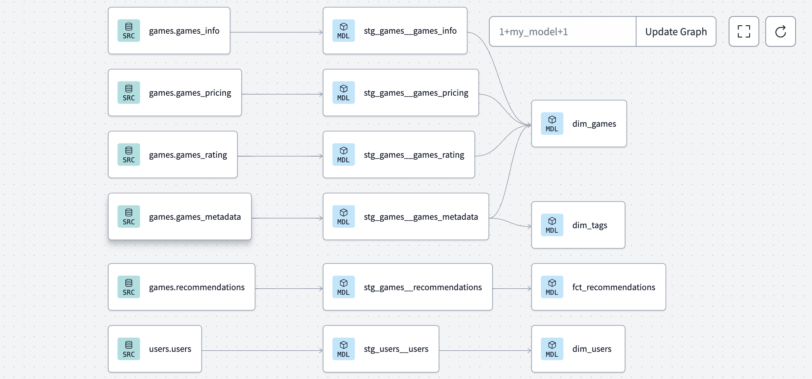
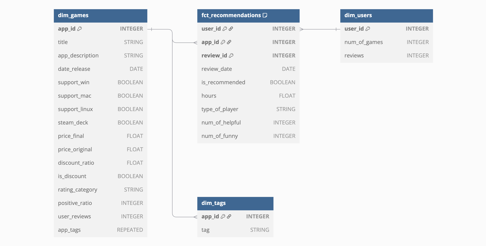

# Game Recommendations on Steam

## Purpose
To find the game recommendations insights, designing a star schema data model and building a data transformation pipeline with dbt.

## Data Source
The source from [Kaggle dataset](https://www.kaggle.com/datasets/antonkozyriev/game-recommendations-on-steam) is restructured by this project to mimic the OLTP (Online Transactional Processing) database.
Overall, it contains detailed information about games, user profiles and over 41 million user recommendations (reviews) from a Steam Store.
```
Sources
├── games
│   ├── games_info
│   ├── games_metadata
│   ├── games_pricing
│   ├── games_rating
├── recommend
│   ├── recommendations
├── users
│   ├── users
```

## Data Pipeline and Lineage Overview 
You can know more about the pipeline flow of ETL (Extract, Transform, Load) which follows the recommendations of dbt's offical documents about modular data modeling technique.
A Slowly Changing Dimension (SCD) Type 2 is implemented on `stg_games__games_info` to demonstrate how to retain all historical values from the sources.



## Data Warehouse Modeling
The following model is designed using the Star Schema (Kimball) methodology and includes dimension tables: `dim_users`, `dim_games` and `dim_tags`, and a fact table `fct_recommendations`.
- `dim_users`: A table containing public user profile information, such as the number of purchased products and published reviews.
- `dim_games` and `dim_tags`: One table contains game-related information, including ratings, pricing in US dollars ($), release dates, descriptions, and tags. The other table stores tags associated with games.
- `fct_recommendations`: A table containing user reviews that indicate whether a user recommends a gmae. This table represents a many-to-many relationship between game entities and user entities.



## How it works
Try running the following commands:
- dbt run
- dbt test
- dbt build
- dbt docs generate: [dbt docs](https://lu917.us1.dbt.com/accounts/70471823449893/develop/70471823706679/docs/index.html#!/source/source.gaming.games.games_info)


